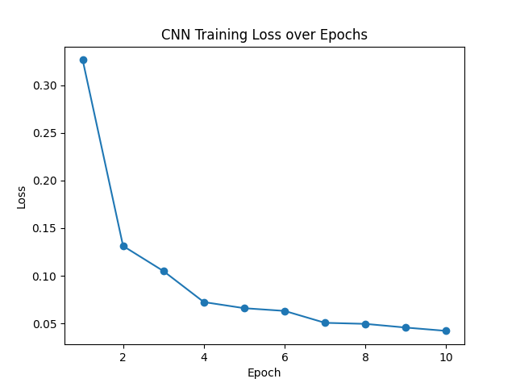
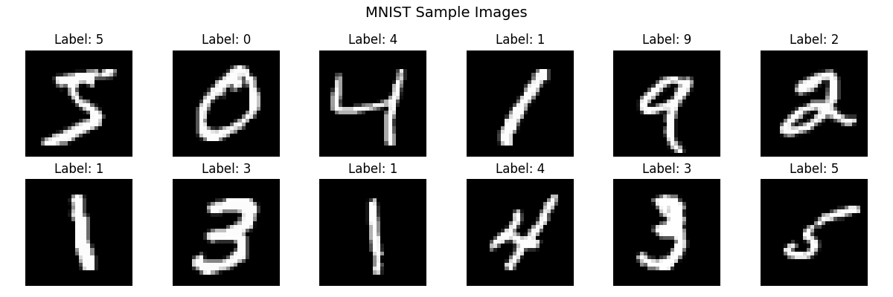

# 🧠 Handwritten Digit Recognition (MNIST)

A simple Machine Learning project that trains a neural network to recognize handwritten digits (0–9) using the MNIST dataset.

This project walks through the complete ML workflow:
- Data exploration
- Model building
- Training & evaluation
- Prediction on custom images

---

## 📂 Project Structure
```
digit-recognizer/
│
├── 01_explore_data.py # Load + visualize MNIST dataset
├── 02_build_model.py # Define neural network architecture
├── 03_train.py # Train model + evaluate + save
├── 04_predict.py # Predict digits from custom images
│
├── model/
│ └── digit_model.pth # Trained model weights
│
├── mnist_samples.png # Sample dataset images
├── training_loss.png # Loss curve visualization
│
├── data/ # Dataset (auto-downloaded)
├── .gitignore
└── README.md
```

---

## 📊 Dataset

- **Dataset:** MNIST
- **Training samples:** 60,000
- **Test samples:** 10,000
- **Image size:** 28×28 grayscale

Data is automatically downloaded using `torchvision.datasets`.

---

## 🧠 Model Architecture

A simple feedforward neural network:
```
Input (28x28 = 784)
↓
Linear (784 → 128)
↓
ReLU
↓
Linear (128 → 64)
↓
ReLU
↓
Linear (64 → 10)
↓
Output (digits 0–9)
```

Defined in: `02_build_model.py` :contentReference[oaicite:0]{index=0}

---

## ⚙️ Training Details

- Loss Function: CrossEntropyLoss
- Optimizer: Adam (lr = 0.001)
- Epochs: 10
- Batch Size: 64

Training pipeline implemented in: `03_train.py` :contentReference[oaicite:1]{index=1}

---

## 📉 Training Performance

Loss decreases steadily over epochs:



Final test accuracy is printed after training.

---

## 🖼️ Sample Data



Generated using: `01_explore_data.py` :contentReference[oaicite:2]{index=2}

---

## 🔮 Prediction

You can test your model on custom handwritten images:

```bash
python 04_predict.py
Input: Path to image
Output: Predicted digit + confidence

Prediction pipeline:

Convert to grayscale
Crop digit
Resize to 28×28
Normalize (MNIST stats)
Feed into model

Implemented in: 04_predict.py

---

🚀 How to Run
1. Install dependencies
pip install torch torchvision matplotlib pillow
2. Explore dataset
python 01_explore_data.py
3. Train model
python 03_train.py
4. Predict custom digits
python 04_predict.py
⚠️ Notes
Model is simple (no CNN), so accuracy is decent but not state-of-the-art
Works best with clean, centered handwritten digits
Custom images are preprocessed to match MNIST format

---